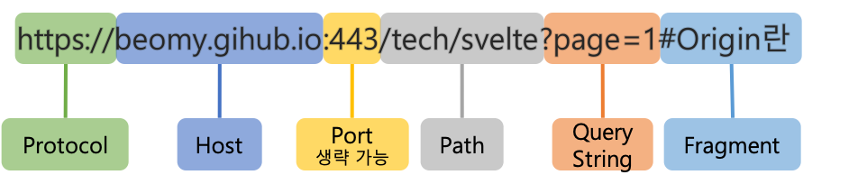

# CORS란?

CORS란 (Cross Origin Resource Sharing)의 약자로 웹 브라우저에서 다른 출처(Origin)의 리소스를 요청할 수 있도록 하는 메커니즘이다. 브라우저에서는 보안상의 이유로 `cross-origin` HTTP 요청들을 제한하기 때문에 서버의 동의가 필요하다. 이러한 요청에 대한 허락을 구하고 거절하는 메커니즘은 HTTP-header를 이용하여 실현된다.

# 출처 (Origin)

출처라는 개념에 대해서 알기 위해서는 먼저 URL의 구조에 대해 알아봐야 한다. URL의 구조는 아래의 그림과 같다.



여기서 출처(Origin)이란 위의 그림에서 `Protocol`, `Host`, `Port`를 합친것을 출처()라고 일컫는다. 3가지 중 하나라도 다른 값을 가진다면 다른 출처를 가지는 것이다.

## ▶ 동일 출처 정책

하나의 출처에서 로드된 문서 또는 스크립트가 다른 출처의 리소스와 상호작용할 수 있는 방법을 제한하여 다른 출처 공격을 예방할 수 있다.

# CORS 동작 원리

## ▶ Simple Request

simple request는 다음 조건을 모두 충족해야만 한다.

* 요청 메서드가 `GET`, `HEAD`, `POST`인 경우 
* `Accept`, `Accept-Language`, `Content-Language`, `Content-Type`, `DPR`, `Downlink`, `Save-Data`, `Viewport-Width`, `Width`를 제외한 헤더 사용X
* `Content-Type` 헤더는 `application/x-www-form-urlencoded`, `multipart/form-data`, `text/plain` 중 하나를 사용하여야 한다

위의 3가지 조건을 서버로 전달하는 request가 만족하였을 때 단순 동작으로 작동한다

## ▶ Preflight Request

서버에 예비요청을 보내 안전하지 판단한 후 본 요청을 보내는 방식이다. `OPTIONS`메서드를 통해 서버에 예비요청을 보내면 서버에서 이에대한 응답으로 `Access Control-Allow-Origin`헤더를 포함한 응답을 브라우저로 보내준다. 


## ▶ Credetialed Request

`Credetialed Request`는 쿠키나 인증정보를 인식한다. 기본적으로 CORS정책은 다른 출처 요총에 인증정보 포함을 허용하지 않기에 요청에 인증을 포함하는 플래그가 존재하거나 `access-control`allow`credentials`가 `true`로 설정된 경우에 요청할 수 있다


# Spring에서 CORS설정

* 전역설정
```java
    @Configuration
    public class WebSecurityConfig implements WebMvcConfigurer {
        @Override
        public void addCorsMappings(CorsRegistry registry) {
            // CORS를 적용할 URL 패턴 정의
            registry.addMapping("/**")
                // 자원을 허락할 Origin 지정
                .allowedOrigins("*")
                // 허용할 HTTP method 지정
                .allowedMethods("*")
                // 허용할 헤더를 지정
                .allowedHeader("*")
        }
    }
```
* `Annotation`이용
    * 컨트롤러에서 사용
    ```java
        @RequestMapping("/**")
        @CrossOrigin(origins="*", allowedMethods="*")
        public class Controller {

        }
    ```
    * 메서드에 적용
    ```java
        @RestController
        @RequestMapping("/**")
        public class Controller {

            @CrossOrigin(origins="*", allowerHeader="*")
            @RequestMapping(value="/a")
            public String getHello(){
                return "Hello Springboot";
            }

        }
    ```

## 요소

* `allowedMethod` : `GET`, `PUT`, `POST`, `DELETE`, `HEAD`중 허용할 HTTP method를 지정할 수 있다
* `allowedOrigin` : CORS요청을 허용하려는 오리진을 지정할 수 있다
* `allowedHeader` : 요청에 허용되는 헤더를 지정할 수 있다.
* `exposeHeader` : 애플리케이션으로부터 접근할 수 있도록 하려는 헤더를 식별한다

# 출처

* https://developer.mozilla.org/ko/docs/Web/HTTP/CORS
* https://developer.mozilla.org/ko/docs/Web/Security/Same-origin_policy
* https://beomy.github.io/tech/browser/cors/
* https://dev-pengun.tistory.com/entry/Spring-Boot-CORS-%EC%84%A4%EC%A0%95%ED%95%98%EA%B8%B0
* https://docs.aws.amazon.com/ko_kr/AmazonS3/latest/userguide/ManageCorsUsing.html#cors-allowed-headers
